[TOC]


# 云计算课程项目文档

## 1 项目整体配置

- 虚拟机：VMware 16
- 操作系统：CentOS-7
- jdk-8u231-linux-x64
- hadoop-3.1.2
- zookeeper-3.4.5
- mysql-5.7.28
- hive-3.1.2

## 2 云系统环境搭建

### 2.1 集群服务器初始化

**2.1.1 虚拟机创建**

1. 单台虚拟机硬件配置如下图所示：

   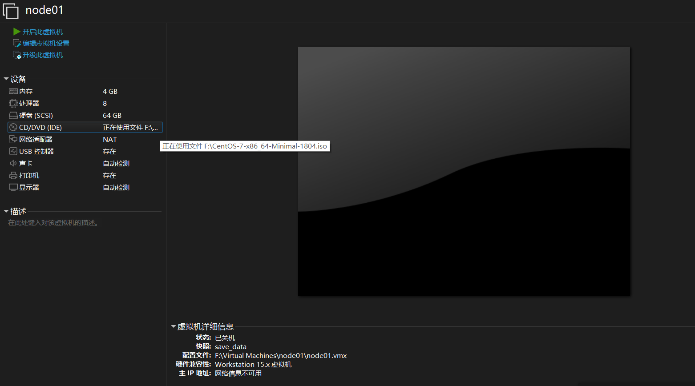

2. 仿照上图中的配置，一共创建了三台虚拟机，命名依次为

   - node01
   - node02
   - node03

**2.1.2 Xshell连接**

1. 在项目中，使用Xshell远程连接三台虚拟机：

   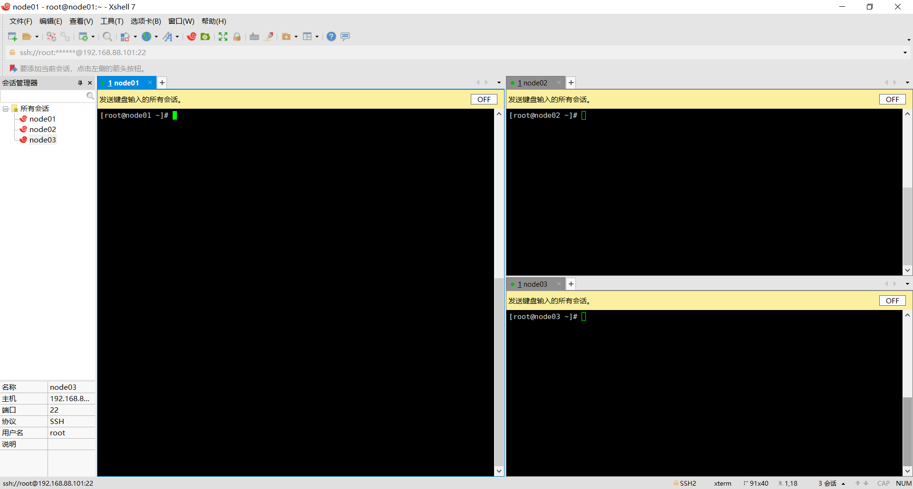

2. 便于之后进行文件的上传，并且支持复制和粘贴操作

**2.1.3 关闭防火墙**

1. 关闭三台机器的防火墙，便于后续进行交互

   ```sh
   systemctl stop firewalld
   systemctl disable firewalld
   systemctl status firewalld
   ```

2. 关闭防火墙后，节点状态如下图所示：

   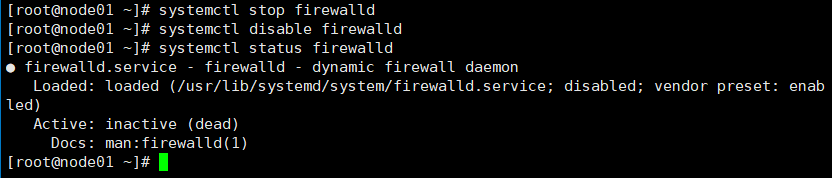

**2.1.4 修改yum源**

1. 将yum换为国内源，提升下载速度和稳定性

2. 首先安装 `wget`

   ```sh
   yum install wget -y
   ```

3. 修改yum源

   ```sh
   mv /etc/yum.repos.d/CentOS-Base.repo /etc/yum.repos.d/CentOS-Base.repo.backup
   wget -O /etc/yum.repos.d/CentOS-Base.repo http://mirrors.aliyun.com/repo/Centos-7.repo
   yum clean all
   yum makecache
   ```

**2.1.5 安装常用软件**

1. 安装后续使用中会经常用到的常用软件

   ```sh
   yum install man man-pages ntp vim lrzsz zip unzip telnet perl net-tools -y
   ```

**2.1.6 DNS域名配置**

1. 配置三台服务器的DNS映射，后续访问时只需输入域名

   ```sh
   echo "192.168.88.100 basenode" >> /etc/hosts
   echo "192.168.88.101 node01" >> /etc/hosts
   echo "192.168.88.102 node02" >> /etc/hosts
   echo "192.168.88.103 node03" >> /etc/hosts
   ```

**2.1.7 安装jdk**

1. 下载并解压jdk包，版本为8u231

   ```sh
   rpm -ivh jdk-8u231-linux-x64.rpm
   ```

2. 配置系统环境变量

   ```sh
   echo 'export JAVA_HOME=/usr/java/jdk1.8.0_231-amd64' >> /etc/profile
   echo 'export PATH=$JAVA_HOME/bin:$PATH' >> /etc/profile
   ```

3. 重新加载环境变量

   ```sh
   source /etc/profile
   ```

**2.1.8 安装Mysql数据库**

1. 卸载mariadb

   ```sh
   rpm -qa | grep mariadb
   rpm -e --nodeps mariadb-libs-5.5.60-1.el7_5.x86_64
   ```

2. 安装Mysql

   ```sh
   tar -xvf mysql-5.7.28-1.el7.x86_64.rpm-bundle.tar
   rpm -ivh mysql-community-common-5.7.28-1.el7.x86_64.rpm
   rpm -ivh mysql-community-libs-5.7.28-1.el7.x86_64.rpm
   rpm -ivh mysql-community-client-5.7.28-1.el7.x86_64.rpm
   rpm -ivh mysql-community-server-5.7.28-1.el7.x86_64.rpm
   ```

### 2.2 服务器相互免密钥

**2.2.1 生成密钥**

1. 三台主机依次生成密钥

   ```sh
   【123】ssh-keygen -t rsa -P '' -f ~/.ssh/id_rsa
   ```

2. 结果如下图所示：

   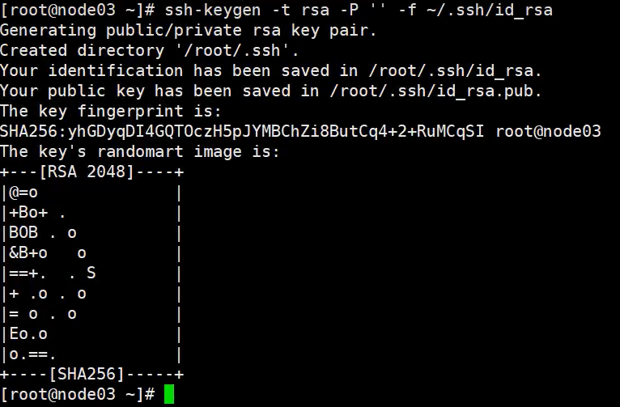

**2.2.2 解除host验证**

1. 在`/etc/ssh/ssh_config`中解除host验证

   ```sh
   【123】vim /etc/ssh/ssh_config
   
   ## 在文件末尾添加
   StrictHostKeyChecking no
   UserKnownHostsFile /dev/null
   ```

2. 添加后如下图所示：

   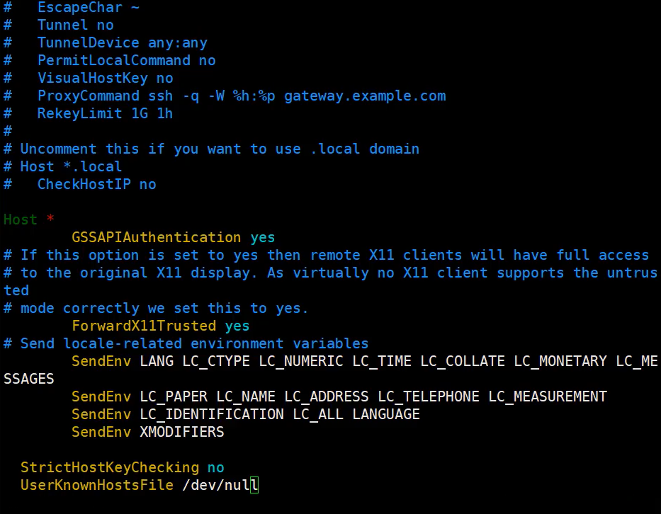

**2.2.3 拷贝密钥**

1. 将生成的密钥分别拷贝给自己和别人

   ```sh
   【123】ssh-copy-id -i ~/.ssh/id_rsa.pub root@bd1701
   【123】ssh-copy-id -i ~/.ssh/id_rsa.pub root@bd1702
   【123】ssh-copy-id -i ~/.ssh/id_rsa.pub root@bd1703
   ```

### 2.3 Zookeeper环境搭建

**2.3.1 准备安装环境**

1. 上传并解压Zookeeper压缩包，本项目使用的版本为3.4.5

   ```shell
   [root@node01 ~]# tar -zxvf zookeeper-3.4.5.tar.gz
   ```

**2.3.2 修改配置文件**

1. 生成`zoo.cfg`文件

   ```
   [root@node01 conf]# cd /opt/bdp/zookeeper-3.4.5/conf/
   [root@node01 conf]# cp zoo_sample.cfg zoo.cfg
   [root@node01 conf]# vim zoo.cfg
   ```

2. 修改`zoo.cfg`文件，主要修改内容如下：

   ```sh
   # tge directory where the snapshot is stored.
   dataDir=/var/bdp/zookeeper
   # the port at which the clients will connect
   clientPort=2181
   
   # 设置服务器内部通信的地址和zk集群的节点
   server.1=node01:2888:3888
   server.2=node02:2888:3888
   server.3=node03:2888:3888
   ```

**2.3.3 创建myid**

1. 在Zookeeper目录下创建myid文件

   ```sh
   [123] touch /var/bdp/zookeeper/myid
   ```

2. 依次在三台服务器中设置各自对应的id

   ```sh
   [1] echo 1 > /var/bdp/zookeeper/myid
   [2] echo 2 > /var/bdp/zookeeper/myid
   [3] echo 3 > /var/bdp/zookeeper/myid
   ```

**2.3.4 拷贝Zookeeper**

1. 将Zookeeper拷贝到其他两台服务器上

   ```sh
   [root@node01 ~]# scp -r zookeeper-3.4.5 root@node02:opt/bdp/
   [root@node01 ~]# scp -r zookeeper-3.4.5 root@node03:opt/bdp/
   ```

**2.3.5 设置环境变量**

1. 在`/etc/profile`文件中添加Zookeeper环境变量

   ```sh
   vim /etc/profile
   
   ## 在文件末尾添加
   export ZOOKEEPER_HOME=/opt/bdp/zookeeper-3.4.5
   export PATH=$ZOOKEEPER_HOME/bin:$PATH
   ```

2. 将`profile`文件拷贝到其他两台服务器中

   ```sh
   [1] scp /etc/profile root@node02:/etc/profile
   [1] scp /etc/profile root@node03:/etc/profile
   ```

3. 重新加载三台服务器的环境变量

   ```sh
   [123] source /etc/profile
   ```

**2.3.6 集群测试**

1. 启动Zookeeper集群

   ```
   [123] zkServer.sh start
   ```

   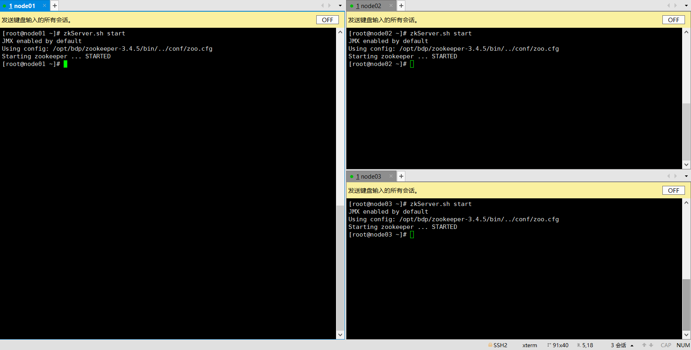

2. 集群状态查看

   ```sh
   [123] zkServer.sh status
   ```

   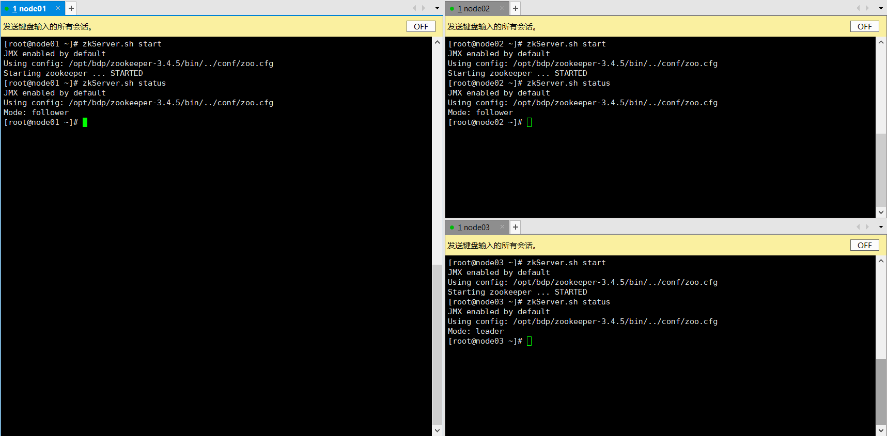

   可以看到当前myid最大的node03成为了leader，node01和node02作为follower

3. 关闭集群

   ```sh
   [123] zkServer.sh stop
   ```

### 2.4 Hadoop高可用集群环境搭建

**2.4.1 Hadoop HA整体架构**

1. 在本项目中，使用了Hadoop HA架构模式，实现了集群的高可用。

   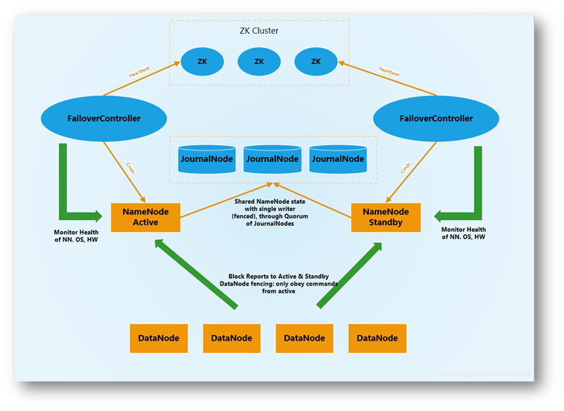

2. 各节点所承担的功能如下：

   1. Active NameNode（ANN）：集群的主NN节点
      - 接收客户端请求，查询数据块DN信息
      - 存储数据的元数据信息：数据文件、Block、DN之间的映射关系
      - 启动时，接收DN的Block汇报形成映射信息
      - 工作时，时刻和DN保持心跳连接
   2. Standby NameNode（SNN）：集群的备用NN节点
      - 与ANN做相同的工作，但不会发送指令
      - 处理日志文件和镜像，并在达到阈值时进行合并
   3. JournalNode（JNN）：集群中存放日志信息的小集群
      - 接收ANN传递的日志信息
      - 为SNN提供日志信息，供SNN整合
   4. DataNode（DN）：集群中实际存放数据的节点
      - 启动时，检测当前节点上的Block是否完整，并上报ANN和SNN
      - 运行时，和ANN和SNN同时保持心跳，但只接受主节点发出的命令
   5. Zookeeper Failover Controller（ZKFC）：集群中检测NN的节点
      - 实时监测NN的健康状况
      - 在主NN发生故障时，借助Zookeeper实现自动的主备选举和切换
   6. Zookeeper：集群中的协调系统
      - 为ZKFC提供主备选举支持
      - 辅助投票
      - 和ZKFC保持心跳连接，确定ZKFC的存活

3. 在实际的实现过程中，三台虚拟机所承担的节点角色如下表所示

|        | NameNode-1 | NameNode-2 | DataNode | Zookeeper | ZKFC | jouralNode |
| ------ | ---------- | ---------- | -------- | --------- | ---- | ---------- |
| Node01 | *          |            | *        | *         | *    | *          |
| Node02 |            | *          | *        | *         | *    | *          |
| Node03 |            |            | *        | *         |      | *          |

**2.4.2 准备安装环境**

1. 解压hadoop压缩文件，本项目所使用的版本为3.1.2

   ```
   [root@node01 ~]# tar -zxvf hadoop-3.1.2.tar.gz
   ```

2. 切换hadoop的文件位置

   ```
   [root@node01 ~]# mv hadoop-3.1.2 /opt/bdp
   [root@node01 ~]# cd /opt/bdp/hadoop-3.1.2/etc/hadoop/
   ```

**2.4.3 修改集群环境**

1. 修改`hadoop-env.sh`文件中的环境信息

   ```sh
   [root@node01 hadoop]# vim hadoop-env.sh
   
   # 在文件末尾添加
   export JAVA_HOME=/usr/java/jdk1.8.0_231-amd64
   export HDFS_NAMENODE_USER=root
   export HDFS_DATANODE_USER=root
   export HDFS_ZKFC_USER=root
   export HDFS_JOURNALNODE_USER=root
   export YARN_RESOURCEMANAGER_USER=root
   export YARN_NODEMANAGER_USER=root
   ```

**2.4.4 修改配置文件**

1. 修改`core-site.xml`文件中的核心信息

   ```sh
   [root@node01 hadoop]# vim core-site.xml
   ```

   ```xml
   <property>
   <name>fs.defaultFS</name>
   <value>hdfs://hdfs-bdp</value>
   </property>
   <property>
   <name>hadoop.tmp.dir</name>
   <value>/var/bdp/hadoop/ha</value>
   </property>
   <property>
   <name>hadoop.http.staticuser.user</name>
   <value>root</value>
   </property>
   <property>
   <name>ha.zookeeper.quorum</name>
   <value>node01:2181,node02:2181,node03:2181</value>
   </property>
   ```

2. 修改`hdfs-site.xml`文件中有关hdfs的信息

   ```sh
   [root@node01 hadoop]# vim hdfs-site.xml
   ```

   ```xml
   <property>
   <name>dfs.nameservices</name>
   <value>hdfs-bdp</value>
   </property>
   <property>
   <name>dfs.ha.namenodes.hdfs-bdp</name>
   <value>nn1,nn2</value>
   </property>
   <property>
   <name>dfs.namenode.rpc-address.hdfs-bdp.nn1</name>
   <value>node01:8020</value>
   </property>
   <property>
   <name>dfs.namenode.rpc-address.hdfs-bdp.nn2</name>
   <value>node02:8020</value>
   </property>
   <property>
   <name>dfs.namenode.http-address.hdfs-bdp.nn1</name>
   <value>node01:9870</value>
   </property>
   <property>
   <name>dfs.namenode.http-address.hdfs-bdp.nn2</name>
   <value>node02:9870</value>
   </property>
   <property>
   <name>dfs.namenode.shared.edits.dir</name>
   <value>qjournal://node01:8485;node02:8485;node03:8485/hdfs-bdp</value>
   </property>
   <property>
   <name>dfs.journalnode.edits.dir</name>
   <value>/var/bdp/hadoop/ha/qjm</value>
   </property>
   <property>
   <name>dfs.client.failover.proxy.provider.hdfs-bdp</name>
   <value>org.apache.hadoop.hdfs.server.namenode.ha.ConfiguredFailoverProxyProvider</value>
   </property>
   <property>
   <name>dfs.ha.fencing.methods</name>
   <value>sshfence</value>
   <value>shell(true)</value>
   </property>
   <property>
   <name>dfs.ha.fencing.ssh.private-key-files</name>
   <value>/root/.ssh/id_rsa</value>
   </property>
   <property>
   <name>dfs.ha.automatic-failover.enabled</name>
   <value>true</value>
   </property>
   <property>
   <name>dfs.replication</name>
   <value>2</value>
   </property>
   ```

3. 修改`workers`信息

   ```sh
   [root@node01 hadoop]# vim workers
   ```

   ```sh
   # 文件内容改为
   node01
   node02
   node03
   ```

**2.4.5 拷贝分发软件**

1. 将配置好的软件分发到其他两台服务器

   ```sh
   [root@node02 ~]# scp -r root@node01:/opt/bdp/hadoop-3.1.2 /opt/bdp/
   [root@node03 ~]# scp -r root@node01:/opt/bdp/hadoop-3.1.2 /opt/bdp/
   ```

**2.4.6 修改环境变量**

1. 在`/etc/profile`文件中添加Hadoop的环境变量

   ```sh
   [root@node01 hadoop]# vim /etc/profile
   ```

   ```sh
   export HADOOP_HOME=/opt/bdp/hadoop-3.1.2
   export PATH=$HADOOP_HOME/bin:$HADOOP_HOME/sbin:$PATH
   ```

2. 将环境变量拷贝给其他两台服务器

   ```sh
   [root@node01 bdp]# scp /etc/profile root@node02:/etc/profile
   [root@node01 bdp]# scp /etc/profile root@node03:/etc/profile
   ```

3. 重新加载三台服务器的环境变量

   ```sh
   [123]# source /etc/profile
   ```

**2.4.7 测试集群**

1. 首先启动Zookeeper

   ```sh
   [123] zkServer.sh start
   [123] zkServer.sh status
   ```

2. 启动JournalNode

   ```
   [123] hdfs --daemon start journalnode
   ```

3. 格式化NameNode

   ```sh
   [root@node01 bdp]# hdfs namenode -format
   [root@node01 bdp]# hdfs --daemon start namenode
   [root@node02 bdp]# hdfs namenode -bootstrapStandby
   [root@node01 bdp]# hdfs zkfc -formatZK
   ```

4. 启动hadoop

   ```sh
   [root@node01 bdp]# start-dfs.sh
   ```

5. 开始测试

   - 添加目录

     - ```sh
       [root@node01 ~]# hdfs dfs -mkdir -p /bdp
       ```

   - 上传文件

     - ```sh
       [root@node01 ~]# hdfs dfs -put zookeeper-3.4.5.tar.gz /bdp/
       ```

   - 下载文件

     - ```sh
       [root@node01 ~]# hdfs dfs -get /bdp/zookeeper-3.4.5.tar.gz  ./
       ```

6. 检验结果
   - 可以通过可视化界面来查看当前hdfs中的内容，url分别为：
     - http://node01:9870
     - http://node02:9870
   - 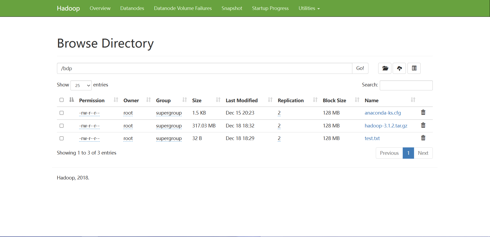

7. 关闭集群

   ```sh
   [root@node01 ~]# stop-dfs.sh
   [123]# zkServer.sh stop
   ```

### 2.5 yarn环境搭建

**2.5.1 yarn整体架构**

1. 在实际的实现过程中，三台虚拟机所承担的节点角色如下表所示

|        | ResouceManager | NodeManager |
| ------ | -------------- | ----------- |
| Node01 | *              | *           |
| Node02 |                | *           |
| Node03 | *              | *           |

**2.5.2 修改集群环境**

1. 修改`hadoop-env.sh`文件中的环境信息

   ```sh
   [root@node01 hadoop]# vim hadoop-env.sh
   ```

   ```sh
   # 在文件末尾添加
   export JAVA_HOME=/usr/java/jdk1.8.0_231-amd64
   export HDFS_NAMENODE_USER=root
   export HDFS_DATANODE_USER=root
   export HDFS_ZKFC_USER=root
   export HDFS_JOURNALNODE_USER=root
   export YARN_RESOURCEMANAGER_USER=root
   export YARN_NODEMANAGER_USER=root
   ```

**2.5.3 修改配置文件**

1. 修改`mapred-site.xml`文件中关于`mapreduce`的信息

   ```sh
   [root@node01 hadoop]# vim mapred-site.xml
   ```

   ```xml
   <!-- 指定mr框架为yarn方式 -->
   <property>
   <name>mapreduce.framework.name</name>
   <value>yarn</value>
   </property>
   <!--job运行日志信息访问地址 -->
   <property>
   <name>mapreduce.jobhistory.address</name>
   <value>node01:10020</value>
   </property>
   <!-- jobhistory web访问地址 -->
   <property>
   <name>mapreduce.jobhistory.webapp.address</name>
   <value>node01:19888</value>
   </property>
   <!-- 在什么目录下存放已经运行完的Hadoop作业记录 -->
   <property>
   <name>mapreduce.jobhistory.done-dir</name>
   <value>/history/done</value>
   </property>
   <property>
   <name>mapreduce.jobhistory.intermediate.done-dir</name>
   <value>/history/done/done_intermediate</value>
   </property>
   <property>
   <name>mapreduce.application.classpath</name>
   <value>
   /opt/bdp/hadoop-3.1.2/etc/hadoop,
   /opt/bdp/hadoop-3.1.2/share/hadoop/common/*,
   /opt/bdp/hadoop-3.1.2/share/hadoop/common/lib/*,
   /opt/bdp/hadoop-3.1.2/share/hadoop/hdfs/*,
   /opt/bdp/hadoop-3.1.2/share/hadoop/hdfs/lib/*,
   /opt/bdp/hadoop-3.1.2/share/hadoop/mapreduce/* ,   
   /opt/bdp/hadoop-3.1.2/share/hadoop/mapreduce/lib/*,
   /opt/bdp/hadoop-3.1.2/share/hadoop/yarn/*,
   /opt/bdp/hadoop-3.1.2/share/hadoop/yarn/lib/*    
   </value>
   </property>
   ```

2. 修改`yarn-site.xml`文件中关于yarn的信息

   ```sh
   [root@node01 hadoop]# vim yarn-site.xml
   ```

   ```xml
   <!-- 开启RM高可用 -->
   <property>
   <name>yarn.resourcemanager.ha.enabled</name>
   <value>true</value>
   </property>
   <!-- 指定RM的cluster id -->
   <property>
   <name>yarn.resourcemanager.cluster-id</name>
   <value>yarn-bdp</value>
   </property>
   <!-- 指定RM的名字 -->
   <property>
   <name>yarn.resourcemanager.ha.rm-ids</name>
   <value>rm1,rm2</value>
   </property>
   <!-- 分别指定RM的地址 -->
   <property>
   <name>yarn.resourcemanager.hostname.rm1</name>
   <value>node01</value>
   </property>
   <property>
   <name>yarn.resourcemanager.hostname.rm2</name>
   <value>node03</value>
   </property>
   <property>
   <name>yarn.resourcemanager.webapp.address.rm1</name>
   <value>node01:8088</value>
   </property>
   <property>
   <name>yarn.resourcemanager.webapp.address.rm2</name>
   <value>node03:8088</value>
   </property>
   
   <!-- 指定zk集群地址 -->
   <property>
   <name>yarn.resourcemanager.zk-address</name>
   <value>node01:2181,node02:2181,node03:2181</value>
   </property>
   <property>
   <name>yarn.nodemanager.aux-services</name>
   <value>mapreduce_shuffle</value>
   </property>
   <!-- 开启日志聚合 -->
   <property>
   <name>yarn.log-aggregation-enable</name>
   <value>true</value>
   </property>
   <property>
   <name>yarn.log-aggregation.retain-seconds</name>
   <value>86400</value>
   </property>
   <!-- 启用自动恢复 -->
   <property>
   <name>yarn.resourcemanager.recovery.enable</name>
   <value>true</value>
   </property>
   <!-- 制定resourcemanager的状态信息存储在zookeeper集群上 -->
   <property>
   <name>yarn.resourcemanager.store.class</name>
   <value>org.apache.hadoop.yarn.server.resourcemanager.recovery.ZKRMStateStore</value>
   </property>
   
   <property>
   <name>yarn.nodemanager.vmem-check-enabled</name>
   <value>false</value>
   </property>
   <property>
   <name>yarn.nodemanager.vmem-pmem-ratio</name>
   <value>3</value>
   </property>
   ```

**2.5.4 拷贝到其他节点**

1. 将配置好的yarn文件分发到其他两台服务器

   ```sh
   [root@node01 hadoop]# scp yarn-site.xml mapred-site.xml root@node02:`pwd`
   [root@node01 hadoop]# scp yarn-site.xml mapred-site.xml root@node03:`pwd`
   ```

**2.5.5 测试集群**

1. 开启集群

   ```sh
   [123] zkServer.sh start
   [root@node01 hadoop]# start-dfs.sh
   [root@node01 hadoop]# start-yarn.sh
   [root@node01 hadoop]# mr-jobhistory-daemon.sh start historyserver
   ```

2. 查看可视化界面，url为

   - http://node01:8088
   - 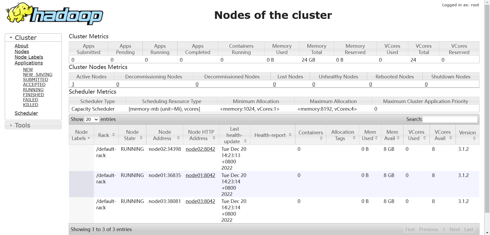

3. 关闭集群

   ```sh
   [1] stop-all.sh
   [1] mr-jobhistory-daemon.sh stop historyserver
   [123] zkServer.sh stop
   ```

### 2.6 hive环境搭建

**2.6.1 hive整体架构**

1. 在实际的实现过程中，三台虚拟机所承担的节点角色如下表所示

|        | metastore | hiveserver2 | client |
| ------ | --------- | ----------- | ------ |
| node01 | *         | *           |        |
| node02 |           |             | *      |
| node03 |           |             | *      |

**2.6.2 下载上传解压**

1. 下载hive压缩包，本项目所使用的版本为3.1.2，和hadoop对应

2. 将压缩包上传并解压

   ```sh
   [root@node01 hadoop]# tar -zxvf apache-hive-3.1.2-bin.tar.gz
   ```

3. 修改hive文件存放的位置

   ```
   [root@node01 hadoop]# mv apache-hive-3.1.2-bin /opt/bdp/
   [root@node01 hadoop]# cd /opt/bdp/apache-hive-3.1.2-bin/conf
   ```

**2.6.3 修改配置文件**

1. 创建并修改`hive-env.sh`文件中的环境信息

   ```sh
   [root@node01 conf]# cp hive-env.sh.template hive-env.sh
   [root@node01 conf]# vim hive-env.sh
   ```

   ```sh
   # 在文件末尾添加
   export HADOOP_HOME=/opt/bdp/hadoop-3.1.2/
   export HIVE_CONF_DIR=/opt/bdp/apache-hive-3.1.2-bin/conf
   export HIVE_AUX_JARS_PATH=/opt/bdp/apache-hive-3.1.2-bin/lib
   ```

2. 创建并修改`hive-stie.xml`文件中关于hive的配置信息

   ```sh
   [root@node01 conf]# cp hive-default.xml.template hive-site.xml
   [root@node01 conf]# vim hive-site.xml
   ```

   ```xml
   <!-- 删除多余的配置文件 -->
   <property>
   <name>javax.jdo.option.ConnectionURL</name>
   <value>jdbc:mysql://node01:3306/hive?createDatabaseIfNotExist=true</value>
   </property>
    
   <property>
   <name>javax.jdo.option.ConnectionDriverName</name>
   <value>com.mysql.jdbc.Driver</value>
   </property>
    
   <property>
   <name>javax.jdo.option.ConnectionUserName</name>
   <value>root</value>
   </property>
    
   <property>
   <name>javax.jdo.option.ConnectionPassword</name>
   <value>123456</value>
   </property>
    
   <property>
   <name>datanucleus.schema.autoCreateAll</name>
   <value>true</value>
   </property>
   
   <property>
   <name>hive.metastore.schema.verification</name>
   <value>false</value>
   </property>
   <!-- 美化打印数据 -->
   <property>
   <name>hive.cli.print.header</name>
   <value>true</value>
   </property>
   <property>
   <name>hive.cli.print.current.db</name>
   <value>true</value>
   </property>
   <!-- hive server -->
   <property>
   <name>hive.server2.webui.host</name>
   <value>node01</value>
   </property>
   <property>
   <name>hive.server2.webui.port</name>
   <value>10002</value>
   </property>
   <!-- 数据存储位置 -->
   <property>
   <name>hive.metastore.warehouse.dir</name>
   <value>/hive/warehouse</value>
   </property>
   ```

3. 修改`core-stie.xml`文件中的核心配置信息

   ```sh
   [root@node01 conf]# vim /opt/bdp/hadoop-3.1.2/etc/hadoop/core-site.xml
   ```

   ```xml
   <!-- 该参数表示可以通过httpfs接口hdfs的ip地址限制 -->
   <property>
   <name>hadoop.proxyuser.root.hosts</name>
   <value>*</value>
   </property>
   <property>
   <name>hadoop.proxyuser.root.groups</name>
   <value>*</value>
   </property>
   ```

**2.6.4 配置日志组件**

1. 创建日志文件目录

   ```
   [root@node01 ~]# mkdir -p /opt/bdp/apache-hive-3.1.2-bin/logs
   ```

2. 创建并修改`hive-log4j2.properties`配置文件

   ```sh
   [root@node01 conf]# cp hive-log4j2.properties.template hive-log4j2.properties
   [root@node01 conf]# vim hive-log4j2.properties
   ```

   ```properties
   property.hive.long.dir = /opt/bdp/apache-hive-3.1.2-bin/logs
   ```

**2.6.5 添加驱动包**

1. Mysql驱动添加到hive的lib目录下，版本为5.1.32

   ```sh
   [root@node01 ~]# cp ~/mysql-connector-java-5.1.32-bin.jar /opt/bdp/apache-hive-3.1.2-bin/lib/
   ```

2. 删除hadoop中已有的guava-*.jar包

   ```sh
   [root@node01 ~]# rm -rf /opt/bdp/hadoop-3.1.2/share/hadoop/common/lib/guava-*.jar
   [root@node01 ~]# rm -rf /opt/bdp/hadoop-3.1.2/share/hadoop/hdfs/lib/guava-*.jar
   ```

3. 将hive的Guava拷贝给hadoop

   ```sh
   [root@node01 ~]# cp /opt/bdp/apache-hive-3.1.2-bin/lib/guava-*.jar /opt/bdp/hadoop-3.1.2/share/hadoop/common/lib/guava-*.jar
   [root@node01 ~]# cp /opt/bdp/apache-hive-3.1.2-bin/lib/guava-*.jar /opt/bdp/hadoop-3.1.2/share/hadoop/hdfs/lib/guava-*.jar
   ```

**2.6.6 配置环境变量**

1. 修改`/etc/profile`文件，添加hive的环境变量

   ```sh
   export HIVE_HOME=/opt/bdp/apache-hive-3.1.2-bin
   export PATH=$HIVE_HOME/bin:$PATH
   ```

**2.6.7 拷贝到其他节点**

1. 拷贝hive文件夹

   ```sh
   [root@node02 ~]# scp -r root@node01:/opt/bdp/apache-hive-3.1.2-bin /opt/bdp/
   [root@node03 ~]# scp -r root@node01:/opt/bdp/apache-hive-3.1.2-bin /opt/bdp/
   ```

2. 拷贝环境变量

   ```sh
   [root@node01 ~]# scp /etc/profile root@node02:/etc/profile
   [root@node01 ~]# scp /etc/profile root@node03:/etc/profile
   ```

3. 重新加载环境变量

   ```sh
   [123] source /etc/profile
   ```

4. 拷贝`core-site.xml`文件

   ```sh
   [root@node01 ~]# scp /opt/bdp/hadoop-3.1.2/etc/hadoop/core-site.xml root@node02:/opt/bdp/hadoop-3.1.2/etc/hadoop
   [root@node01 ~]# scp /opt/bdp/hadoop-3.1.2/etc/hadoop/core-site.xml root@node03:/opt/bdp/hadoop-3.1.2/etc/hadoop
   ```

5. 拷贝jar包

   ```sh
   [root@node02 ~]# rm -rf /opt/bdp/hadoop-3.1.2/share/hadoop/common/lib/guava-*.jar
   [root@node02 ~]# rm -rf /opt/bdp/hadoop-3.1.2/share/hadoop/hdfs/lib/guava-*.jar
   [root@node03 ~]# rm -rf /opt/bdp/hadoop-3.1.2/share/hadoop/common/lib/guava-*.jar
   [root@node03 ~]# rm -rf /opt/bdp/hadoop-3.1.2/share/hadoop/hdfs/lib/guava-*.jar
   
   [root@node02 ~]# cp /opt/bdp/apache-hive-3.1.2-bin/lib/guava-*.jar /opt/bdp/hadoop-3.1.2/share/hadoop/common/lib/guava-*.jar
   [root@node02 ~]# cp /opt/bdp/apache-hive-3.1.2-bin/lib/guava-*.jar /opt/bdp/hadoop-3.1.2/share/hadoop/hdfs/lib/guava-*.jar
   
   [root@node03 ~]# cp /opt/bdp/apache-hive-3.1.2-bin/lib/guava-*.jar /opt/bdp/hadoop-3.1.2/share/hadoop/common/lib/guava-*.jar
   [root@node03 ~]# cp /opt/bdp/apache-hive-3.1.2-bin/lib/guava-*.jar /opt/bdp/hadoop-3.1.2/share/hadoop/hdfs/lib/guava-*.jar
   ```

**2.6.8 客户端配置文件**

1. 选取node03作为客户端结点，在`hive-site.xml`文件中修改客户端的配置文件

   ```sh
   [3] vim /opt/bdp/apache-hive-3.1.2-bin/conf/hive-site.xml
   ```

   ```xml
   <property>
   <name>hive.metastore.warehouse.dir</name>
   <value>/hive/warehouse</value>
   </property>
   
   <!-- 美化打印数据 -->
   <property>
   <name>hive.cli.print.header</name>
   <value>true</value>
   </property>
   <property>
   <name>hive.cli.print.current.db</name>
   <value>true</value>
   </property>
   
   <property>
   <name>hive.metastore.schema.verification</name>
   <value>false</value>
   </property>
   <property>
   <name>datanucleus.schema.autoCreateAll</name>
   <value>true</value>
   </property>
   
   <!-- 指定hive.metastore.uris的port,为了启动的metastore服务的时候不用指定端口 -->
   <!-- hive==service metastore -p 9083 -->
   <property>
   <name>hive.metastore.uris</name>
   <value>thrift://node01:9083</value>
   </property>
   ```

**2.6.9 测试集群**

1. 启动zookeeper

   ```sh
   [123] zkServer.sh start
   ```

2. 启动hdfs+yarn

   ```sh
   [root@node01 ~]# start-all.sh
   ```

3. 初始化数据库

   ```sh
   [root@node01 ~]# schematool -dbType mysql -initSchema
   ```

   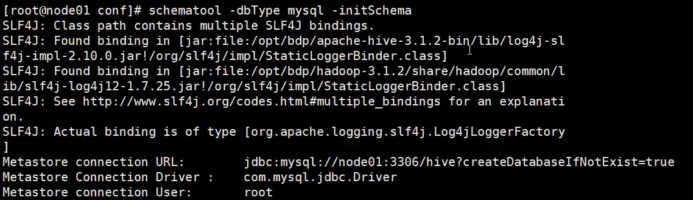

4. 服务器端启动HiveServer2

   ```sh
   [root@node01 ~]# hiveserver2
   ```

   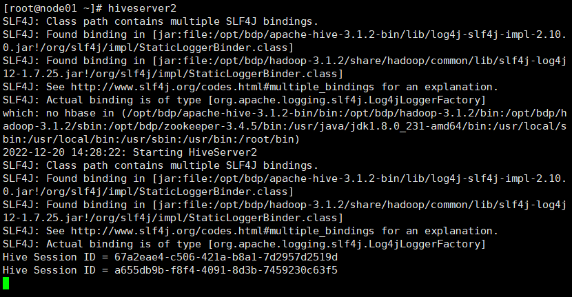

5. 客户端使用`beeline`进行连接

   ```sh
   [root@node03 ~]# beeline -u jdbc:hive2://node01:10000 -n root
   ```

   

## 3 分布式文件存储功能验证

### 3.1 文件上传下载及一致性

1. 在node01本地创建`test.txt`文本文件，其中内容为

   ```
   write by node01
   ```

2. 将`test.txt`文件上传到hdfs上

   ```sh
   hdfs dfs -put test.txt /bdp/
   ```

3. 从主节点的网页端浏览hdfs，切换到相应目录下查看文件内容

   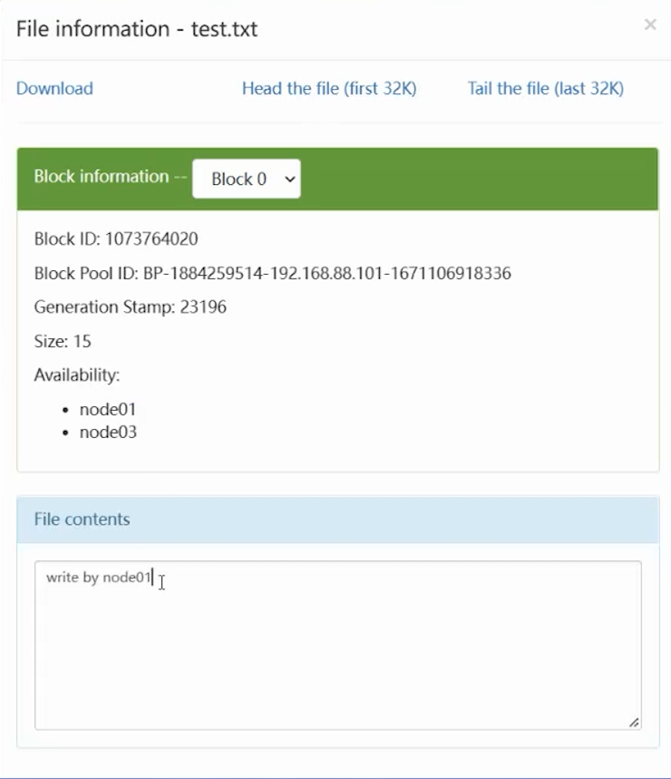

4. 在node02中完成文件的下载

   ```sh
   hdfs dfs -get /bdp/test.txt ./
   ```

5. 查看文件内容并修改

   ```sh
   vim test.txt
   ```

   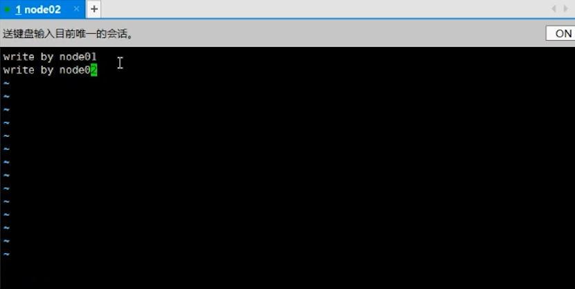

6. 从node02再次上传`test.txt`，`-f`强制更新

   ```
   hdfs dfs -put -f test.txt /bdp/
   ```

7. 从node01的网页端查看更新后的文件内容

   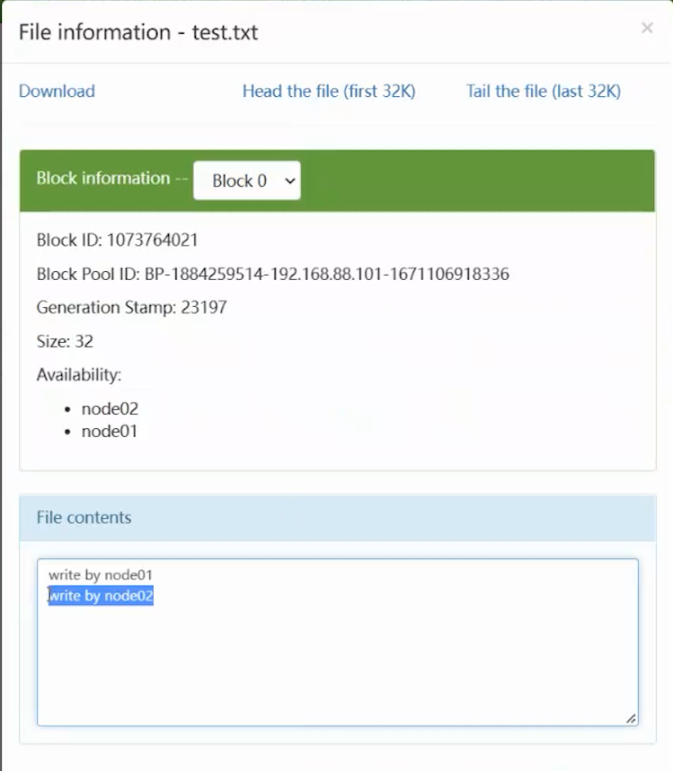

### 3.2 文件分块与备份

1. 上传一个大于`128M`的文件

   ```sh
   hdfs dfs -put hadoop-3.1.2.tar.gz /bdp/
   ```

2. 从网页端查看文件的分块以及备份情况

   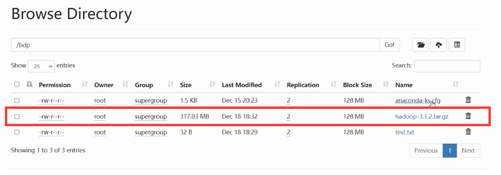

   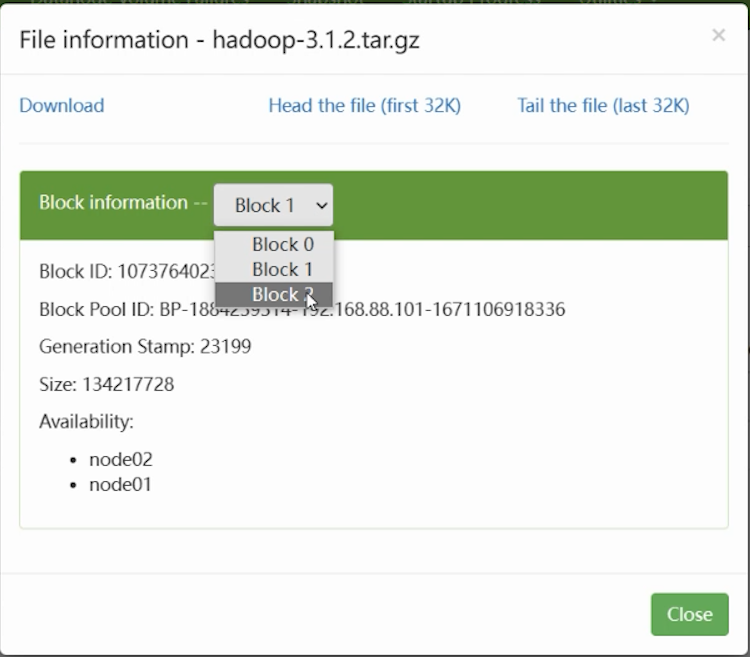

   可以看出当前为`317M`的文件被划分为了3个Block，当前所展示的Block1是由node02和node01同时备份的

### 3.3 DataNode容错处理

1. 在网页端查看各Block所备份的节点情况

   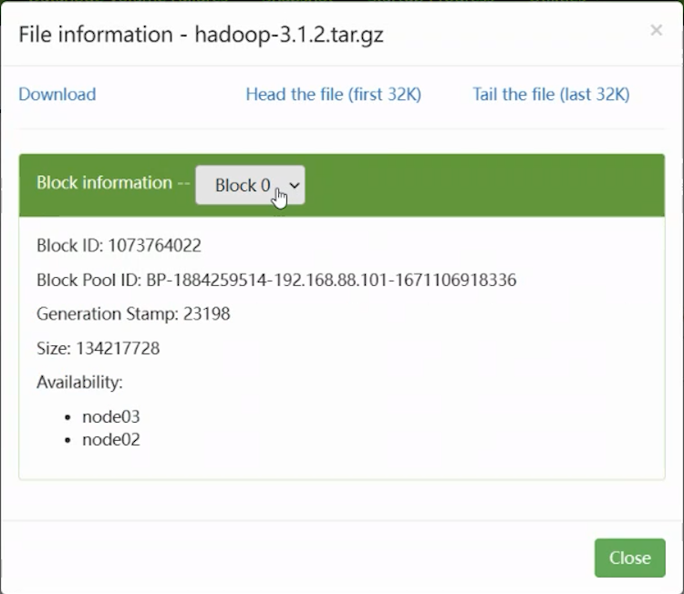

   可以看出当前文件的Block0是由node03和node02所备份的

2. 下线node03节点的DataNode服务

   ```sh
   [root@node03 ~]# hadoop-daemon.sh stop datanode
   ```

3. 查看节点状态

   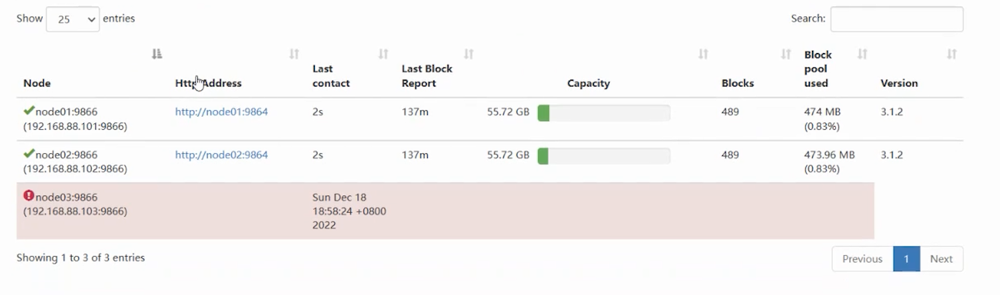

   在经过十分三十秒没有心跳后，集群显示node03下线

4. 再次查看文件备份情况

   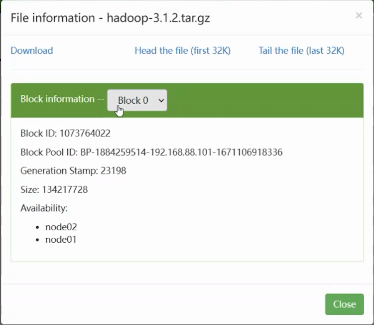

   可以看到现在的Block已经变成了由node02和node01备份

### 3.4 NameNode容错处理

1. 下线当前主NameNode

   ```sh
   [root@node01 ~]# hadoop-daemon.sh stop namenode
   ```

2. 查看主NN节点状态

   

   node01的网页已经无法打开

3. 查看备用NN节点状态

   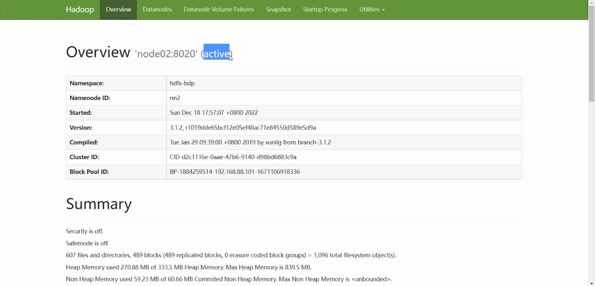

   之前作为备用NN的node02现在变成了主NN

4. 重新上线节点

   ```sh
   [root@node01 ~]# hadoop-daemon.sh start namenode
   ```

5. 再次检查节点状态

   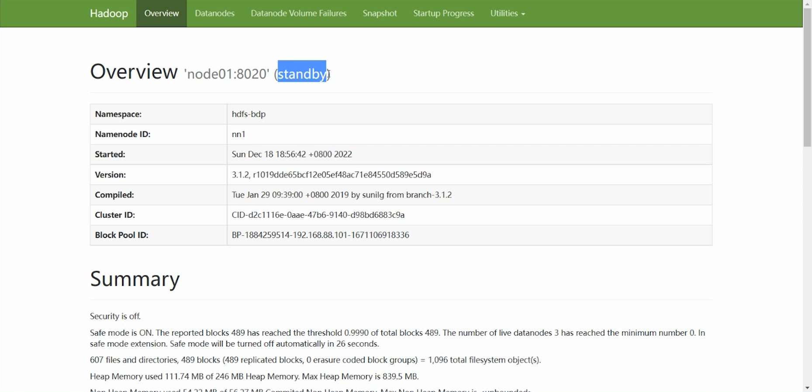

   刚才宕机的node01在重新启动后变成了备用NN，实现了主备切换的功能。

## 4 hive数据存储和查询功能验证

### 4.1 销售数据获取

1. 在本项目中所使用的销售数据为某奢侈品网站的后台销售数据，主要包含了用户对产品的购买记录，可以围绕产品和⽤户两⼤⽅⾯展开数据分析，以制定策略提供分析及建议。

2. 数据集的格式如下图所示：

   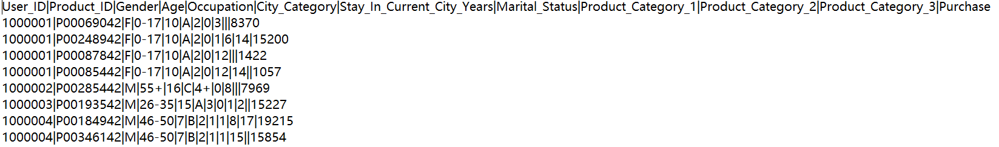

### 4.2 数据库表设计

1. 首先根据文本文件提取出了每条记录所包含的字段信息，如下表所示：

   | **字段名称**               | **字段描述**     |
   | -------------------------- | ---------------- |
   | User_ID                    | 顾客ID           |
   | Product_ID                 | 商品ID           |
   | Gender                     | 顾客性别         |
   | Age                        | 顾客年龄         |
   | Occupation                 | 顾客从事职业     |
   | City_Category              | 城市类别         |
   | Stay_In_Current_City_Years | 在现城市呆的年数 |
   | Marital_Status             | 婚姻状况         |
   | Marital_Status             | 商品类别1        |
   | Product_Category_2         | 商品类别2        |
   | Product_Category_3         | 商品类别3        |
   | Purchase                   | 消费⾦额         |

2. 根据各字段不同的类型，完成了相应的数据库表的设计

   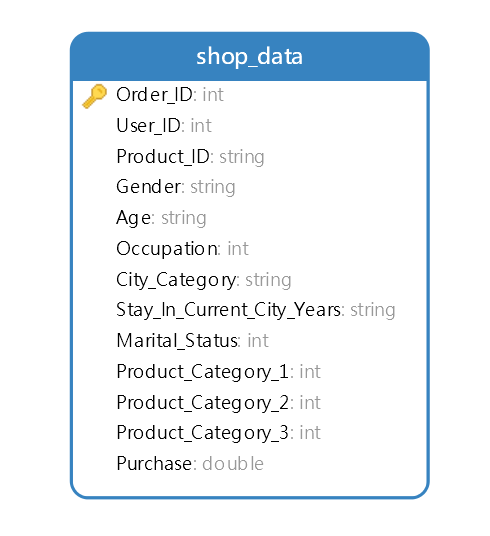

### 4.3 hive数据存储

1. 启动hive之后，创建新的数据库

   ```sql
   create database hive_data
   ```

2. 在新创建的数据库中完成表的创建

   ```sql
   #建表
   create table shop_data
   (Order_ID int,
   User_ID int,
   Product_ID string,
   Gender string,
   Age string,
   Occupation int,
   City_Category string,
   Stay_In_Current_City_Years string,
   Marital_Status int,
   Product_Category_1 int,
   Product_Category_2 int,
   Product_Category_3 int,
   Purchase double
   )
   row format delimited fields terminated by '|' 
   tblproperties(
   "skip.header.line.count"="1"
   );
   
   ```

3. 导入已经下载好的数据文件

   ```sh
   load data inpath '/bdp/shop_data.txt' overwrite into table shop_data;
   ```

### 4.4 hive查询功能验证

1. 完成数据存储后，使用hive来进行简单的查询

   ```sql
   select count(1) from shop_data;
   ```

   上述查询将会返回表中一共有多少条数据

   在运行sql时，由于包含了聚集运算，hive会调用mapreduce来进行分布式的计算

   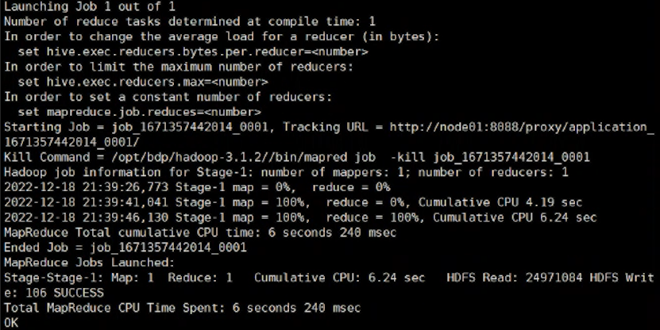

   运行结束后，返回结果如下图所示，数据集一共包含了`537577`条数据

   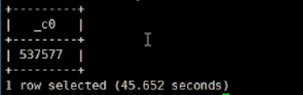

## 5 销售数据可视化界面展示

### 5.1 整体系统架构

1. 在本项目中，使用了网页作为销售数据可视化的方式，整个系统的架构如下图所示

   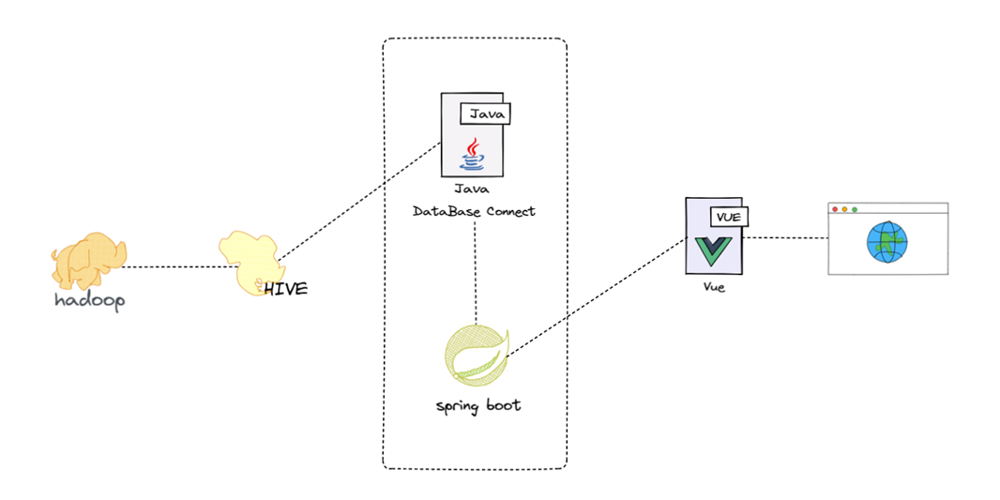

2. 后端使用Spring boot整合jdbc来完成对hive的访问

3. 前端使用Vue框架将数据信息显示在网页中

### 5.2 后端接口代码示例

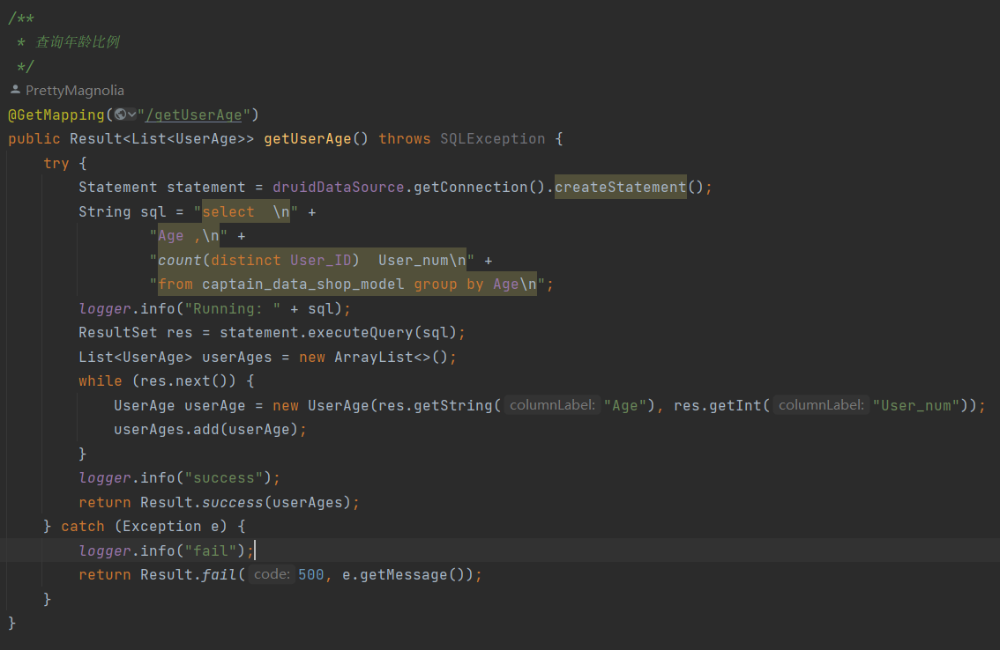

### 5.3 前端页面代码示例

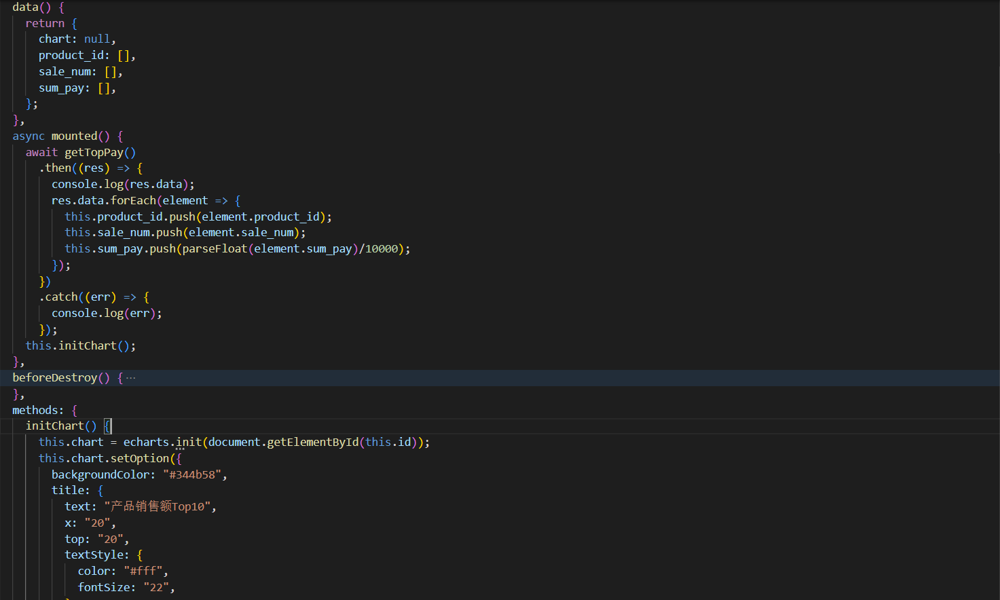

### 5.2 页面功能展示

1. 网站首页展示所使用数据集的概览信息

   

   可以看出通过分析用户各项维度的占比得出使用网站的用户特征为：男性、26-35岁、未婚

2. 产品销量Top10

   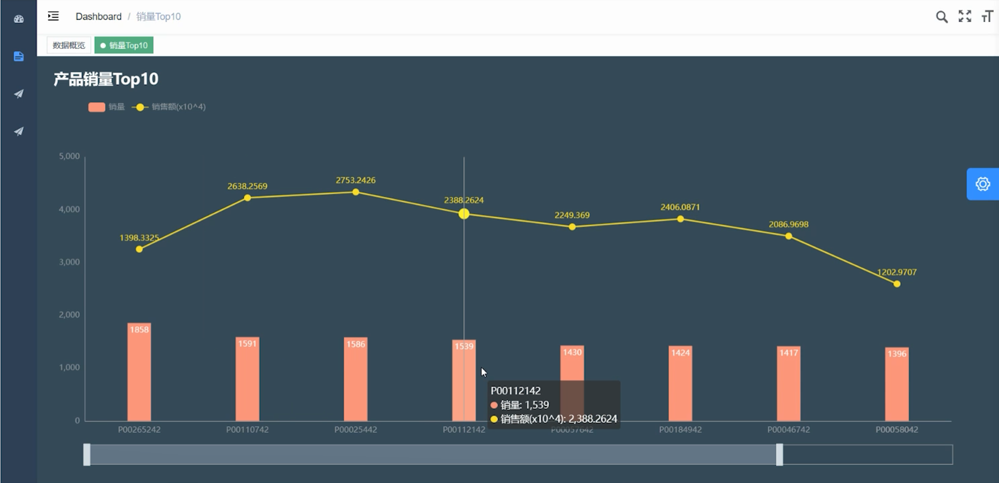

3. 产品销售额Top10

   

4. 组合查询

   使用者输入用户的特征以及排序方式，系统根据条件限制返回相应产品序列，从而能够根据不同用户群体更为精准的推送产品。